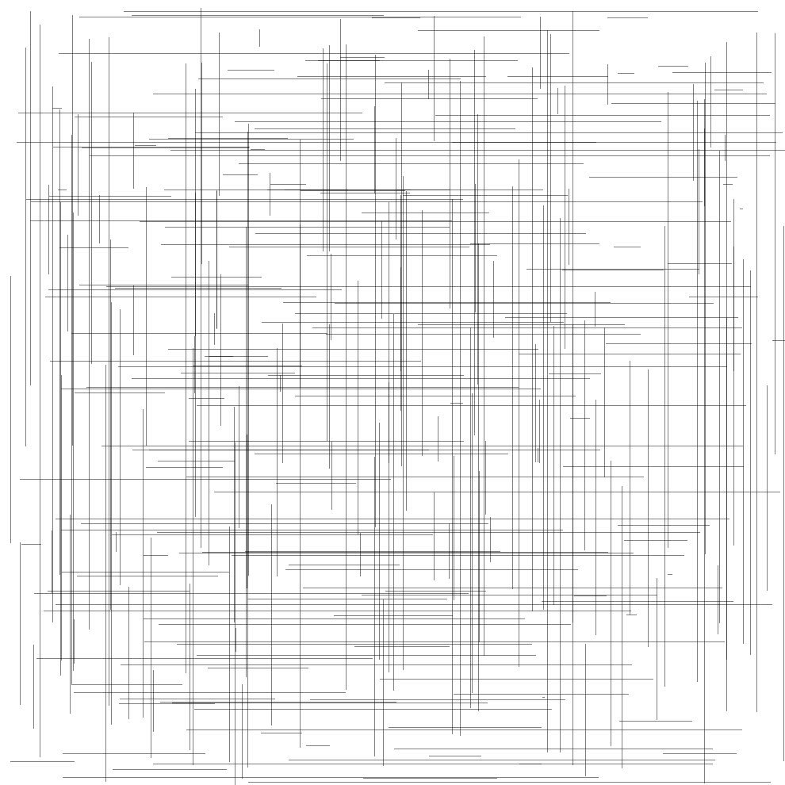
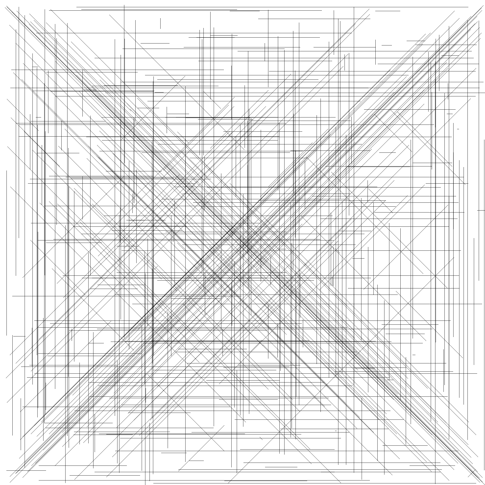
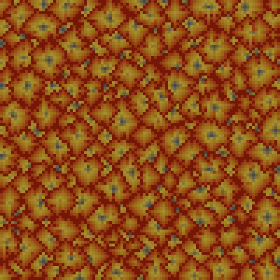

# Advent of Code 2021

## Output

### Day 1
```
> python day01.py

[Part 1] There are 1448 increased measurements.
[Part 2] There are 1471 increased measurements within three-measurement windows.
```

### Day 2
```
> python day02.py

[Part 1] Final horizontal position: 1850. Final depth: 927. Product: 1714950.
[Part 2] Final horizontal position: 1850. Final depth: 692961. Product: 1281977850.
```

### Day 3
```
> python day03.py

[Part 1] Epsilon rate: ε = 1300. Gamma rate: γ = 2795. Power consumption: 3633500.
[Part 2] Oxygen generator rating: 1327. CO2 scrubber rating: 3429. Life support rating: 4550283.
```

### Day 4
```
> python day04.py

[Part 1] Board #64 wins first with a score of 58838.
  Board #64 wins in col 2:
  86    80      77      18      87
  79    93      52      17      20
  30    68      48      12      91
  25    98      13      9       47
  45    73      97      15      59

[Part 2] Board #25 wins last with a score of 6256.
  Board #25 wins in row 5:
  17    16      10      68      76
  2     45      94      29      40
  1     54      60      66      93
  0     13      42      39      70
  6     82      46      74      43
```

### Day 5
```
> python day05.py

[Part 1] There are 5690 points where two or more horizontal or vertical lines overlap.
[Part 2] There are 17741 points where two or more lines of any kind overlap.
```






### Day 6
```
> python day06.py

[Part 1] After 80 days, there are 390011 lanternfish. [Took 0.13s]
[Part 2] After 256 days, there are 1746710169834 lanternfish. [Took 50935.51s]
```

### Day 7
```
> python day07.py

[Part 1] Final horizontal position: 330. Total fuel consumed: 329389.
[Part 2] Final horizontal position: 459. Total fuel consumed: 86397080.
```

### Day 8
```
> python day08.py

[Part 1] There are 470 occurrences of the digits '1', '4', '7', or '8'.
[Part 2] The sum of all output numbers is 989396.
```

```
###   # ### ###
# #   # #   # #
###   # ### ###
# #   # # # # #
###   # ### ###

  # # # ### # #
  # # # # # # #
  # ### # # ###
  #   # # #   #
  #   # ###   #

  # ### ### ###
  # # # # #   #
  # # # ### ###
  # # # # #   #
  # ### ### ###

# # ### ### ###
# # #     # # #
### ### ### ###
  #   #   # # #
  # ### ### ###

---------------

# # # #   # ###
# # # #   # #   
### ###   # ###
  #   #   # # #
  #   #   # ###

# # ### ### ###
# #   # #     #
### ### ###   #
  # #   # #   #
  # ### ###   #

### ### ### ###
  # # #   #   #
  # ###   #   #
  # # #   #   #
  # ###   #   #

### ### ### ###
  #   # # # # #
### ### # # ###
#     # # # # #
### ### ### ###

```

### Day 9
```
> python day09.py

[Part 1] There are 206 low points in the heightmap with a total risk level of 444.
[Part 2] The three largest basins are 107 at (90, 62), 105 at (17, 21), and 104 at (92, 25), with a product of 1168440.
```


